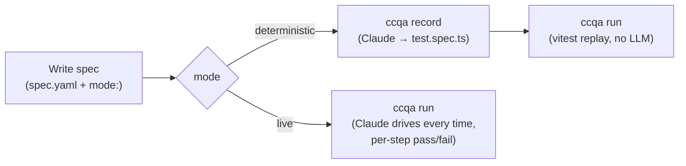

# ccqa

**Your Claude subscription already includes a QA engineer.**

ccqa turns Claude Code into a browser test recorder. Write a spec in YAML, declare in the spec whether it should run **deterministic** or **live**, then `ccqa run` does the right thing per spec:

- **Deterministic** (`mode: deterministic`, default): record once with `ccqa record` — Claude drives the browser and ccqa compiles every action into a `test.spec.ts` you replay in CI under vitest, no LLM at run time. Cheapest and most stable.
- **Live** (`mode: live`): no codegen. `ccqa run` sends each step to Claude every time; Claude drives `agent-browser`, judges pass/fail against the step's `expected`, and saves a before/after screenshot. More flexible for fragile UIs.

No extra API key. Just `claude`.

[日本語版 README](./docs/README.ja.md)

## How it works

Each spec picks its own mode; `ccqa run` reads the field and dispatches. One project mixes both, and one report covers both.



## Install

```bash
pnpm add -D ccqa vitest agent-browser
```

Requires Node.js **20+**. [agent-browser](https://github.com/vercel-labs/agent-browser) is a peer dependency.

## Quick start

**1. Write a spec** — by hand, or interactively with [`ccqa draft`](./docs/draft.md). Declare the mode in the spec itself.

```yaml
# .ccqa/features/tasks/test-cases/create-and-complete/spec.yaml
title: Create a task and mark it complete
mode: deterministic   # or: live. Omit for deterministic (the default).

steps:
  - instruction: |
      Open ${APP_URL}/login. Fill in email and password, submit the form.
    expected: Redirected to /dashboard, user avatar visible in the header

  - instruction: |
      Click "New Task", fill in the title "Fix login bug", set priority to High, save.
    expected: Task appears in the task list with status "Open"
```

URLs live inside `instruction` strings — either verbatim or via `${ENV_VAR}` references for environment-specific values.

**2a. For `mode: deterministic` — record once, then replay**

```bash
ccqa record tasks/create-and-complete   # Claude drives the browser; generates test.spec.ts
ccqa run tasks/create-and-complete      # vitest replays test.spec.ts; no LLM
```

**2b. For `mode: live` — skip codegen, run directly**

```bash
ccqa run tasks/create-and-complete      # Claude drives the browser every time
```

Live specs can start already-signed-in by naming a saved session with `session:` — see [Saved sessions](./docs/sessions.md). Deterministic runs also write step-boundary screenshots to `ccqa-report/evidence/` (disable with `--no-evidence`).

In CI, add `--report` to write a `report.json` (+ evidence PNGs) you push to the [ccqa hub](./docs/hub.md) and view in its UI; each failing spec gets a root-cause call (TEST_DRIFT / SPEC_CHANGE / PRODUCT_BUG) you can grade for accuracy. Needs `ANTHROPIC_API_KEY` or a local Claude login. See [Run report](./docs/report.md).

```bash
ccqa run tasks/create-and-complete --report --base origin/main
ccqa run --changed --report                    # only specs whose relatedPaths touch the diff
```

## Features

| Feature | Docs |
|---|---|
| Write specs interactively with Claude | [Draft](./docs/draft.md) |
| Run specs live (no codegen), with per-project guidance | [Live specs](./docs/live.md) |
| Restore a saved login to skip device-trust gates | [Saved sessions](./docs/sessions.md) |
| Reuse login and other shared step sequences | [Blocks](./docs/blocks.md) |
| Drive `<input type="file">` without an OS picker | [File upload](./docs/file-upload.md) |
| Assertion helper functions | [Assertions](./docs/assertions.md) |
| Auto-fix failing tests | [Auto-fix](./docs/auto-fix.md) |
| Detect spec/code drift in CI | [Drift](./docs/drift.md) |
| HTML run report with failure root-cause calls | [Run report](./docs/report.md) |
| Inventory existing test coverage | [Perspectives](./docs/perspectives.md) |
| Architecture decision records (why it is built this way) | [ADR](./docs/adr/README.md) |
| Aggregate CI run results, sessions, and variables on a shared server | [Hub](./docs/hub.md) |

## Commands

```
ccqa init                          Scaffold .ccqa/prompts/{live,record}.{user,agent}.md templates
ccqa draft [feature/spec]          Co-author a test spec with Claude
ccqa perspectives                  Inventory existing test coverage into .ccqa/perspectives.yaml
ccqa record <feature/spec>         (deterministic specs only) Trace browser actions + generate test.spec.ts
ccqa run [feature/spec...]         Execute specs. Per spec, the spec.yaml `mode:` field selects deterministic
                                   (vitest replay) or live (Claude drives every time). One run can mix both;
                                   `--report` writes one unified HTML. Pass multiple targets space-separated.
ccqa drift [feature/spec]          Standalone spec ↔ codebase static audit (for PR checks)
ccqa serve                         Start a hub: a control-plane HTTP server that aggregates run results,
                                   sessions, and variables (it does not execute tests)
ccqa hub push                      Push a finished run's report to a hub
ccqa hub session|var <cmd>         Manage sessions/variables stored on a hub
```

Key `ccqa run` flags (see `ccqa run --help` for the rest):

- `--report [dir]` — write the run report (report.json + evidence PNGs) for `ccqa hub push` (default dir: `ccqa-report/`)
- `--profile <name>` — load `.ccqa/profiles/<name>.env` before resolving spec `${VAR}` references, so one spec targets dev/stg/prd. See [Profiles](#profiles---profile).
- `--changed` — restrict execution to specs whose `relatedPaths` intersect `git diff <base>...HEAD`
- `--concurrency <n>` — run up to N specs in parallel **within each mode** (deterministic phase, then live phase — parallelism is per-phase, not across phases). Default `1` (sequential, same behavior as before).
- `--no-failure-analysis` / `--no-drift-audit` — `--no-failure-analysis` skips failure classification (and its drift audit, since drift is the classification's evidence); `--no-drift-audit` keeps classification but skips just the audit.
- `--format <fmt>` — `text` (default), `json` (report.json), `github` (Actions annotations)

`<feature/spec>` is a 2-segment alias for `.ccqa/features/<feature>/test-cases/<spec>/`; `ccqa run` takes several space-separated targets (a `<feature>/<spec>`, a bare `<feature>`, or none for everything). Claude-driven commands accept `-m/--model`, `--language`, and `--cwd` (for monorepos); they use your local Claude login, and CI commands (`ccqa run --report`, `ccqa drift`) also honor `ANTHROPIC_API_KEY`.

## File structure

```
.ccqa/
  perspectives.yaml              # Inventory of existing coverage (canonical)
  profiles/                      # `--profile <name>` env files (stg.env, prd.env, ...)
  prompts/                       # `ccqa init` scaffolds these; *.user.md human-maintained, *.agent.md auto-updated
    record.user.md  record.agent.md  live.user.md  live.agent.md
  blocks/
    login/spec.yaml              # Reusable block (params + steps)
  features/
    tasks/
      test-cases/
        create-and-complete/
          spec.yaml              # Test definition, with `mode: deterministic | live`
          actions.json           # (deterministic) recorded actions
          test.spec.ts           # (deterministic) generated vitest script
          runs/<timestamp>/      # (live) one `ccqa run` — run.json/run.md + steps/*.png
```

Gitignore the per-run artefacts: `.ccqa/features/*/test-cases/*/runs/` and `ccqa-report*/`.

## Profiles (`--profile`)

Keep environment-specific values out of specs as `${VAR}` references and supply them per environment from a **profile** — a `.env` under `.ccqa/profiles/<name>.env`. `ccqa run`/`record --profile <name>` merges it into the environment before resolving `${VAR}`, so one spec runs anywhere.

```bash
# .ccqa/profiles/stg.env
APP_BASE_URL=https://<your-app-host>
TEST_USER_EMAIL=<stg-test-account>
TEST_USER_PASSWORD=...
```
```bash
ccqa run auth/login --profile stg    # same spec, stg values
```

- Format is a small `.env` subset (`KEY=value`, `#` comments, `export`, quotes); profile values **override** the inherited environment.
- Name is free-form (`stg`/`prd` by convention); path separators, `..`, and leading dots are rejected, and an unknown name exits 2. Only the name is logged, never values.
- Without `--profile`, ccqa auto-loads `<cwd>/.env` if present; with neither, `${VAR}` resolves against the existing `process.env`.
- **Secrets:** gitignore any profile holding plaintext secrets. To keep secrets off disk entirely, drop `--profile` and run ccqa under your secret manager (e.g. `op run --env-file=... -- ccqa run ...`), which injects resolved values into `process.env`.

## Live specs (`mode: live`)

For specs declared `mode: live` in their spec.yaml, `ccqa run` skips codegen entirely: Claude executes each spec step against `agent-browser` directly, judges whether the step's `expected` outcome holds, and saves a PNG screenshot before and after every step. Use this mode when:

- you want to validate a spec but don't yet need a replayable, recorded test
- the codegen output for a spec is fragile (heavily timing-dependent UIs, rich-text editors, dynamic selectors)
- you want a visual audit trail of what the page looked like at every step

Constraints on selectors / `agent-browser` subcommands that apply during `ccqa record` (no `eval`, no `@ref`, no bare-tag positional `find`, no chained agent-browser calls) are relaxed for live specs, since there is no replay contract to honour.

See [Live specs](./docs/live.md) for usage examples and per-project guidance.

### Saved sessions (`session:`)

Some providers gate every fresh browser with a device-trust check (an "unrecognized device" e-mail code, an MFA prompt) that a human has to clear by hand — impractical to repeat on every run, impossible in CI. `session:` restores a saved, signed-in browser state instead.

```yaml
title: Admin can open the settings page
mode: live
session: admin            # restore the saved "admin" session before step 1
steps:
  - ...                   # no login steps — the spec starts signed-in
```

ccqa does not manage authentication — `session` is purely an optional restore of cookies + localStorage.

See [Saved sessions](./docs/sessions.md) for how to bootstrap a session and use it in CI.

## CI result aggregation (hub)

`ccqa serve` starts a hub — a control-plane HTTP server that aggregates CI run results, saved sessions, and variables on a shared server. It does not execute tests: a CI job (or a laptop) runs `ccqa run --report` as usual, fetching whatever sessions/variables/prompts it needs from the hub directly at run time, then `ccqa hub push` uploads the resulting report to the hub. Sessions and variables are registered on the hub ahead of time (`ccqa hub session push`, `ccqa hub var set`, or the bundled UI's Secrets tab), so a CI job needs only one secret: `CCQA_HUB_TOKEN`. One hub manages many projects — secrets are scoped per project/profile, and `--project` defaults to the current directory's name. See [docs/hub.md](./docs/hub.md) for setup and usage.

## License

MIT
