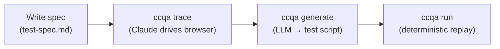

# ccqa

**Your Claude subscription already includes a QA engineer.**

ccqa turns Claude Code into a browser test recorder. Write a spec in Markdown, run `ccqa trace`, and Claude drives your app via [agent-browser](https://github.com/vercel-labs/agent-browser). Every action is recorded and compiled into a deterministic test script you can run in CI. No extra API key. Just `claude`.

[日本語版 README](./docs/README.ja.md)

## How it works



`trace` invokes Claude Code with your spec. Claude drives the browser step by step, recording every action as structured data. `generate` compiles that data into a vitest-compatible script. `run` replays it deterministically — no LLM involved.

## Install

```bash
pnpm add -D ccqa vitest agent-browser
```

Requires Node.js **20+**. [agent-browser](https://github.com/vercel-labs/agent-browser) is a peer dependency.

## Quick start

**1. Write a spec** — by hand, or interactively with [`ccqa draft`](./docs/draft.md)

```markdown
<!-- .ccqa/features/tasks/test-cases/create-and-complete/test-spec.md -->
---
title: Create a task and mark it complete
baseUrl: http://localhost:3000
---

## Steps

### Step 1: Log in
- **Instruction**: Fill in email and password, submit the form
- **Expected**: Redirected to /dashboard, user avatar visible in the header

### Step 2: Create a new task
- **Instruction**: Click "New Task", fill in the title "Fix login bug", set priority to High, save
- **Expected**: Task appears in the task list with status "Open"
```

**2. Trace** — Claude drives the browser and records every action

```bash
ccqa trace tasks/create-and-complete
```

**3. Generate** — convert recorded actions into a replayable test

```bash
ccqa generate tasks/create-and-complete
```

**4. Run** — replay deterministically, no LLM involved

```bash
ccqa run tasks/create-and-complete
```

## Features

| Feature | Docs |
|---|---|
| Write specs interactively with Claude | [Draft](./docs/draft.md) |
| Reuse login and other setup steps | [Setup Specs](./docs/setup-specs.md) |
| Assertion helper functions | [Assertions](./docs/assertions.md) |
| Auto-fix failing tests | [Auto-fix](./docs/auto-fix.md) |
| Detect spec/code drift in CI | [Drift](./docs/drift.md) |

## Commands

```
ccqa draft [feature/spec]          Co-author a test spec with Claude
ccqa drift [feature/spec]          Check spec ↔ codebase drift (CI-friendly)
ccqa trace <feature/spec>          Record browser actions
ccqa generate <feature/spec>       Generate test script from recorded actions
ccqa run [feature/spec]            Execute generated test scripts
ccqa trace-setup <name>            Record actions for a setup spec
ccqa generate-setup <name>         Generate and validate setup test script
```

All Claude-driven commands accept `-m, --model <name>` (alias `sonnet` | `opus` | `haiku`, or a full model ID). The flag overrides `CCQA_MODEL`; when both are unset, the Claude Code CLI default is used. Interactive commands authenticate via your local Claude Code login; `ccqa drift` additionally honors `ANTHROPIC_API_KEY` for CI.

`<feature/spec>` is a 2-segment alias for the on-disk path `.ccqa/features/<feature>/test-cases/<spec>/`.

## File structure

```
.ccqa/
  setups/
    login/
      setup-spec.md              # Setup definition with placeholders
      test.spec.ts               # Generated setup script
  features/
    tasks/
      test-cases/
        create-and-complete/
          test-spec.md           # Test definition
          actions.json           # Recorded actions from trace
          test.spec.ts           # Generated test script
```

## License

MIT
