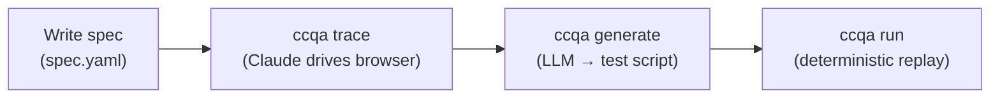

# ccqa

**Your Claude subscription already includes a QA engineer.**

ccqa turns Claude Code into a browser test recorder. Write a spec in YAML, run `ccqa trace`, and Claude drives your app via [agent-browser](https://github.com/vercel-labs/agent-browser). Every action is recorded and compiled into a deterministic test script you can run in CI. No extra API key. Just `claude`.

[日本語版 README](./docs/README.ja.md)

## How it works



`trace` invokes Claude Code with your spec. Claude drives the browser step by step, recording every action as structured data. `generate` compiles that data into a vitest-compatible script. `run` replays it deterministically — no LLM involved.

## Install

```bash
pnpm add -D ccqa vitest agent-browser
```

Requires Node.js **20+**. [agent-browser](https://github.com/vercel-labs/agent-browser) is a peer dependency.

## Quick start

**1. Write a spec** — by hand, or interactively with [`ccqa draft`](./docs/draft.md)

```yaml
# .ccqa/features/tasks/test-cases/create-and-complete/spec.yaml
title: Create a task and mark it complete

steps:
  - instruction: |
      Open ${APP_URL}/login. Fill in email and password, submit the form.
    expected: Redirected to /dashboard, user avatar visible in the header

  - instruction: |
      Click "New Task", fill in the title "Fix login bug", set priority to High, save.
    expected: Task appears in the task list with status "Open"
```

URLs live inside `instruction` strings — either verbatim or via `${ENV_VAR}` references for environment-specific values.

**2. Trace** — Claude drives the browser and records every action

```bash
ccqa trace tasks/create-and-complete
```

**3. Generate** — convert recorded actions into a replayable test

```bash
ccqa generate tasks/create-and-complete
```

**4. Run** — replay deterministically, no LLM involved

```bash
ccqa run tasks/create-and-complete
```

In CI you can opt in to an HTML run report by passing `--drift-report` — every failing spec gets a drift audit plus a root-cause call (TEST_DRIFT / SPEC_CHANGE / PRODUCT_BUG) using the PR diff as context, and the report lets a human grade those calls to measure their accuracy. Requires `ANTHROPIC_API_KEY` or a local Claude login for the analysis part. See [Run report](./docs/report.md).

```bash
ccqa run tasks/create-and-complete --drift-report --drift-base origin/main
```

## Features

| Feature | Docs |
|---|---|
| Write specs interactively with Claude | [Draft](./docs/draft.md) |
| Reuse login and other shared step sequences | [Blocks](./docs/blocks.md) |
| Assertion helper functions | [Assertions](./docs/assertions.md) |
| Auto-fix failing tests | [Auto-fix](./docs/auto-fix.md) |
| Detect spec/code drift in CI | [Drift](./docs/drift.md) |
| HTML run report with failure root-cause calls | [Run report](./docs/report.md) |
| Inventory existing test coverage | [Perspectives](./docs/perspectives.md) |
| Architecture decision records (why it is built this way) | [ADR](./docs/adr/README.md) |

## Commands

```
ccqa draft [feature/spec]          Co-author a test spec with Claude
ccqa trace <feature/spec>          Record browser actions for a spec (inlines any included blocks)
ccqa generate <feature/spec>       Generate test script from recorded actions
ccqa run [feature/spec]            Execute generated test scripts (add --drift-report for an HTML report with failure analysis)
ccqa drift [feature/spec]          Standalone spec ↔ codebase drift audit (for scheduled jobs)
ccqa perspectives                  Inventory existing test coverage into .ccqa/perspectives.yaml
```

All Claude-driven commands accept `-m, --model <name>` (alias `sonnet` | `opus` | `haiku`, or a full model ID). The flag overrides `CCQA_MODEL`; when both are unset, the Claude Code CLI default is used. They also accept `--language <bcp47>` (e.g. `ja`, `en`) to set the language of human-readable output; the default `auto` follows the language of the spec/codebase. Interactive commands authenticate via your local Claude Code login; commands that talk to Claude in CI (`ccqa run --drift-report`, `ccqa drift`) additionally honor `ANTHROPIC_API_KEY`.

`<feature/spec>` is a 2-segment alias for the on-disk path `.ccqa/features/<feature>/test-cases/<spec>/`.

## File structure

```
.ccqa/
  perspectives.yaml              # Inventory of existing coverage (machine-readable, canonical)
  perspectives.md                # Category index, regenerated from the YAML
  blocks/
    login/
      spec.yaml                  # Reusable block (params + steps)
  features/
    tasks/
      perspectives.md            # Per-category detail tables (one per case)
      test-cases/
        create-and-complete/
          spec.yaml              # Test definition
          actions.json           # Recorded actions from trace
          test.spec.ts           # Generated test script
```

## License

MIT
