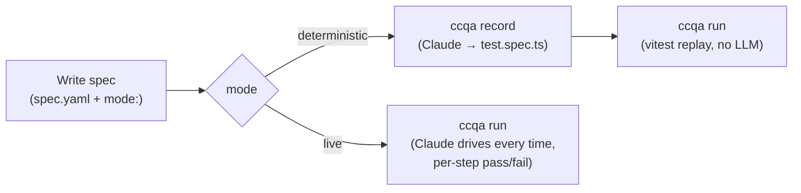

# ccqa

**Your Claude subscription already includes a QA engineer.**

ccqa turns Claude Code into a browser test recorder. Write a spec in YAML, declare in the spec whether it should run **deterministic** or **live**, then `ccqa run` does the right thing per spec:

- **Deterministic** (`mode: deterministic`, default): record once with `ccqa record`. Claude drives the browser, ccqa compiles every action into a `test.spec.ts` you can replay in CI under vitest — no LLM at run time. Cheapest and most stable.
- **Live** (`mode: live`): no codegen. `ccqa run` sends each step to Claude every time, Claude drives `agent-browser` directly, judges pass/fail against the step's `expected`, and saves a before/after screenshot. More flexible for fragile UIs.

A single project mixes both: each spec.yaml picks its own mode, and `ccqa run` reads the field and dispatches. The HTML report covers both in one page.

No extra API key. Just `claude`.

[日本語版 README](./docs/README.ja.md)

## How it works



For deterministic specs, `record` invokes Claude Code with your spec, Claude drives the browser step by step, every action is recorded, and a vitest-compatible script is generated. `run` then replays it without involving an LLM.

For live specs, `record` is not needed. `run` directly sends each step to Claude, which drives the browser through `agent-browser`, judges whether the step's `expected` clause holds, and writes a PNG before and after each step. Useful when codegen is fragile (timing-dependent UIs, rich-text editors, dynamic selectors).

## Install

```bash
pnpm add -D ccqa vitest agent-browser
```

Requires Node.js **20+**. [agent-browser](https://github.com/vercel-labs/agent-browser) is a peer dependency.

## Quick start

**1. Write a spec** — by hand, or interactively with [`ccqa draft`](./docs/draft.md). Declare the mode in the spec itself.

```yaml
# .ccqa/features/tasks/test-cases/create-and-complete/spec.yaml
title: Create a task and mark it complete
mode: deterministic   # or: live. Omit for deterministic (the default).

steps:
  - instruction: |
      Open ${APP_URL}/login. Fill in email and password, submit the form.
    expected: Redirected to /dashboard, user avatar visible in the header

  - instruction: |
      Click "New Task", fill in the title "Fix login bug", set priority to High, save.
    expected: Task appears in the task list with status "Open"
```

URLs live inside `instruction` strings — either verbatim or via `${ENV_VAR}` references for environment-specific values.

**2a. For `mode: deterministic` — record once, then replay**

```bash
ccqa record tasks/create-and-complete   # Claude drives the browser; generates test.spec.ts
ccqa run tasks/create-and-complete      # vitest replays test.spec.ts; no LLM
```

**2b. For `mode: live` — skip codegen, run directly**

```bash
ccqa run tasks/create-and-complete      # Claude drives the browser every time
```

Live specs can start already-signed-in by naming a saved session with `session:`. Create it once with `ccqa session bootstrap <name>` (log in by hand, ccqa saves the cookies + localStorage), then specs restore it — see [Saved sessions](#saved-sessions-session) below for the bootstrap and the CI restore pattern.

By default deterministic runs write step-boundary screenshots and metadata to `ccqa-report/evidence/<feature>/<spec>/` so a reviewer can confirm a passing spec actually reached the states its `expected` clauses describe. Disable with `--no-evidence`.

In CI you can opt in to an HTML run report by passing `--report` — every failing spec gets a drift audit plus a root-cause call (TEST_DRIFT / SPEC_CHANGE / PRODUCT_BUG) using the branch's git diff as context, and the report lets a human grade those calls to measure their accuracy. Requires `ANTHROPIC_API_KEY` or a local Claude login for the analysis part. Opt out with `--no-failure-analysis` (which also implicitly skips the drift audit — the audit is rendered as evidence under the classification, so without the classification the cost has nowhere to land). Use `--no-drift-audit` to keep the classification but skip the audit. See [Run report](./docs/report.md).

```bash
ccqa run tasks/create-and-complete --report --base origin/main
ccqa run --changed --report                    # only specs whose relatedPaths touch the diff
```

## Features

| Feature | Docs |
|---|---|
| Write specs interactively with Claude | [Draft](./docs/draft.md) |
| Reuse login and other shared step sequences | [Blocks](./docs/blocks.md) |
| Drive `<input type="file">` without an OS picker | [File upload](./docs/file-upload.md) |
| Assertion helper functions | [Assertions](./docs/assertions.md) |
| Auto-fix failing tests | [Auto-fix](./docs/auto-fix.md) |
| Detect spec/code drift in CI | [Drift](./docs/drift.md) |
| HTML run report with failure root-cause calls | [Run report](./docs/report.md) |
| Inventory existing test coverage | [Perspectives](./docs/perspectives.md) |
| Architecture decision records (why it is built this way) | [ADR](./docs/adr/README.md) |

## Commands

```
ccqa init                          Scaffold .ccqa/prompts/{live,record}.{user,agent}.md templates
ccqa draft [feature/spec]          Co-author a test spec with Claude
ccqa perspectives                  Inventory existing test coverage into .ccqa/perspectives.yaml
ccqa record <feature/spec>         (deterministic specs only) Trace browser actions + generate test.spec.ts
ccqa run [feature/spec...]         Execute specs. Per spec, the spec.yaml `mode:` field selects deterministic
                                   (vitest replay) or live (Claude drives every time). One run can mix both;
                                   `--report` writes one unified HTML. Pass multiple targets space-separated.
ccqa drift [feature/spec]          Standalone spec ↔ codebase static audit (for PR checks)
```

`ccqa run` flags:

- `--report [dir]` — write a self-contained HTML run report (default dir: `ccqa-report/`)
- `--profile <name>` — load `.ccqa/profiles/<name>.env` into the environment before resolving spec `${VAR}` references, so one spec targets dev/stg/prd without per-environment copies. See [Profiles](#profiles---profile).
- `--changed` — restrict execution to specs whose `relatedPaths` intersect `git diff <base>...HEAD`. Mutually exclusive with explicit spec targets.
- `--concurrency <n>` — run up to N specs in parallel **within each mode** (deterministic specs run as one phase, live specs as the next; parallelism is within a phase, not across). Default `1` (sequential, identical to before). Above 1, each spec's output is buffered and flushed as a labelled block so parallel logs stay legible. Live specs each launch their own headed Chrome, so high values spawn many browser instances.
- `--base <ref>` — base ref for the git diff (default: `$GITHUB_BASE_REF`, then `origin/main`)
- `--no-failure-analysis` — skip the per-failure root-cause classification (also skips the drift audit, since the audit only shows under the classification)
- `--no-drift-audit` — skip the spec ↔ code drift audit while keeping the classification
- `--no-evidence` — (deterministic specs only) skip step-boundary PNG capture
- `--retry <n>` — (live specs only) retry each failing step up to N more times
- `--format <fmt>` — `text` (default), `json` (report.json), `github` (Actions annotations)
- `--out <dir>` — (live specs only, single-spec invocations) override the per-run artifact directory
- `--update-agent-prompt` — (live specs only) after the run, summarise it back to Claude and rewrite `.ccqa/prompts/live.agent.md` so the next run inherits the lessons learned. `ccqa record` ships the same flag, refreshing `record.agent.md` from the trace summary.

All Claude-driven commands accept `-m, --model <name>` (alias `sonnet` | `opus` | `haiku`, or a full model ID). The flag overrides `CCQA_MODEL`; when both are unset, the Claude Code CLI default is used. They also accept `--language <bcp47>` (e.g. `ja`, `en`) to set the language of human-readable output; the default `auto` follows the language of the spec/codebase. `--cwd <path>` works on `record` / `run` / `drift` so you can target a subpackage inside a monorepo from the repo root. Interactive commands authenticate via your local Claude Code login; commands that talk to Claude in CI (`ccqa run --report`, `ccqa drift`) additionally honor `ANTHROPIC_API_KEY`.

`<feature/spec>` is a 2-segment alias for the on-disk path `.ccqa/features/<feature>/test-cases/<spec>/`. `ccqa run` accepts several targets space-separated (each a `<feature>/<spec>`, a bare `<feature>` for all its specs, or omitted for everything); duplicates are de-duped and `--changed` cannot be combined with explicit targets.

## File structure

```
.ccqa/
  perspectives.yaml              # Inventory of existing coverage (machine-readable, canonical)
  perspectives.md                # Category index, regenerated from the YAML
  profiles/                      # `--profile <name>` env files
    stg.env                      # URLs + credential refs; commit if it uses secret-manager refs, gitignore if it holds plaintext secrets
    prd.env
  prompts/                       # Run `ccqa init` to scaffold these
    record.user.md               # Human-maintained guidance appended to `ccqa record` (trace phase)
    record.agent.md              # Auto-updated by `ccqa record --update-agent-prompt`
    live.user.md                 # Human-maintained guidance appended to `ccqa run` (live specs)
    live.agent.md                # Auto-updated by `ccqa run --update-agent-prompt`
  blocks/
    login/
      spec.yaml                  # Reusable block (params + steps)
  features/
    tasks/
      perspectives.md            # Per-category detail tables (one per case)
      test-cases/
        create-and-complete/
          spec.yaml              # Test definition, with `mode: deterministic | live`
          actions.json           # (deterministic only) Recorded actions from `ccqa record`
          test.spec.ts           # (deterministic only) Generated vitest script
          runs/
            2026-06-14T10-00-00-000Z/  # (live only) one `ccqa run` invocation
              run.json                  # Machine-readable summary
              run.md                    # Human-readable per-step log
              steps/
                step-01.before.png      # Before-step screenshot
                step-01.after.png       # After-step screenshot
                step-01.log.txt         # Claude's full transcript for the step
```

Add `.ccqa/features/*/test-cases/*/runs/` to `.gitignore` — these are per-run artefacts that should not be committed. Likewise `ccqa-report*/`.

## Profiles (`--profile`)

Keep environment-specific values out of specs as `${VAR}` references and supply them per environment from a **profile** — a `.env` under `.ccqa/profiles/<name>.env`. `ccqa run`/`record --profile <name>` merges it into the environment before resolving `${VAR}`, so one spec runs anywhere.

```bash
# .ccqa/profiles/stg.env
APP_BASE_URL=https://<your-app-host>
TEST_USER_EMAIL=<stg-test-account>
TEST_USER_PASSWORD=...
```
```bash
ccqa run auth/login --profile stg    # same spec, stg values
```

- Name is free-form (`stg`/`prd` are conventions); a path separator / `..` / leading dot is rejected, and a missing profile exits 2. Only the name is logged, never values.
- Format is a small `.env` subset (`KEY=value`, `#` comments, `export`, quotes). Profile values **override** the inherited environment.
- Without `--profile`, ccqa auto-loads `<cwd>/.env` if present (like dotenv); with neither, `${VAR}` resolves against the existing `process.env` (e.g. `direnv`).

**Secrets:** gitignore any profile that holds plaintext secrets. ccqa only parses `.env` files — it doesn't resolve secret-manager references — so to keep secrets off disk, drop `--profile` and run ccqa under your secret manager instead (e.g. `op run --env-file=.ccqa/profiles/stg.env -- ccqa run ...`), which injects the resolved values into `process.env` for ccqa to read.

## Live specs (`mode: live`)

For specs declared `mode: live` in their spec.yaml, `ccqa run` skips codegen entirely: Claude executes each spec step against `agent-browser` directly, judges whether the step's `expected` outcome holds, and saves a PNG screenshot before and after every step. Use this mode when:

- you want to validate a spec but don't yet need a replayable, recorded test
- the codegen output for a spec is fragile (heavily timing-dependent UIs, rich-text editors, dynamic selectors)
- you want a visual audit trail of what the page looked like at every step

```bash
# Run a single live spec
ccqa run tasks/create-and-complete

# Run every spec under a feature (mixes deterministic + live as declared)
ccqa run tasks

# Run every spec in the project, into a unified HTML report
ccqa run --report

# Retry each failing step up to 2 more times (live specs only)
ccqa run --retry 2 tasks/create-and-complete
```

Constraints on selectors / `agent-browser` subcommands that apply during `ccqa record` (no `eval`, no `@ref`, no bare-tag positional `find`, no chained agent-browser calls) are **relaxed** for live specs — Claude can use any subcommand and any selector style because there is no replay contract to honour.

### Saved sessions (`session:`)

By default each `ccqa run` of a live spec starts signed-out and logs in through its own steps. That's fine for plain form logins, but some providers gate every fresh browser with a device-trust check (an "unrecognized device" e-mail code, an MFA prompt) that a human has to clear by hand — impractical to repeat on every run, impossible in CI.

For those, save the signed-in browser state once and let the spec **restore** it. ccqa does not manage authentication — `session` is purely an optional restore of cookies + localStorage. Specs that can just log in normally don't use it.

```yaml
title: Admin can open the settings page
mode: live
session: admin            # restore the saved "admin" session before step 1
steps:
  - ...                   # no login steps — the spec starts signed-in
```

A spec can also restore several sessions at once (e.g. one provider in each), and ccqa merges them:

```yaml
session:
  - admin                 # one provider, signed in as admin
  - admin-chat            # another provider, same person
```

#### Create a session — `ccqa session bootstrap`

```bash
# Opens a headed browser. Log in by hand (clear any device-trust gate),
# then press Enter and ccqa saves the session.
ccqa session bootstrap admin --url https://app.example.com/login

# List saved sessions (names + save times; no secret values shown).
ccqa session ls
```

Sessions are saved to `.ccqa/sessions/<profile>/<name>.json`. The `<profile>` is the same `--profile` that selects the `.ccqa/profiles/<profile>.env` file, so one flag picks both the environment and its sessions bucket; with no `--profile` the bucket is `default`. `ccqa init` drops a self-ignoring `.ccqa/sessions/.gitignore` so saved sessions stay out of git — **they contain live auth cookies and must never be committed.**

When a spec names a session that hasn't been created yet, the run stops and tells you which `ccqa session bootstrap` to run, rather than starting unauthenticated.

#### CI: restore the session

Saved sessions live entirely inside `.ccqa/` and never touch `~/`. In CI, write each session file back to the path the run expects (read it from your secret store):

```bash
# Locally, after bootstrapping, copy the file into your CI secret store:
base64 -i .ccqa/sessions/default/admin.json | pbcopy   # paste as CCQA_SESSION_ADMIN_B64
```

```yaml
# CI step (sketch) — restore before `ccqa run`
- name: Restore session
  env:
    CCQA_SESSION_ADMIN_B64: ${{ secrets.CCQA_SESSION_ADMIN_B64 }}
  run: |
    mkdir -p .ccqa/sessions/default
    printf '%s' "$CCQA_SESSION_ADMIN_B64" | base64 -d > .ccqa/sessions/default/admin.json
```

Notes:

- **Expiry.** The provider's "remember this device" window eventually lapses and the saved cookies stop working. Re-run `ccqa session bootstrap` locally and rotate the secret.
- **Treat session files as credentials.** They hold live auth cookies. Keep them in a secret manager; never commit them.
- **Deterministic specs ignore `session:`.** It only affects `mode: live`; vitest-replayed specs always run isolated.

### Per-project guidance (`.ccqa/prompts/live.user.md` + `live.agent.md`)

ccqa's live-mode system prompt is deliberately product-agnostic. Anything specific to **your** project — staging URLs, login flow quirks, rich-editor types, common access-denied wording — belongs in two sibling files (run `ccqa init` to scaffold both):

- `.ccqa/prompts/live.user.md` — human-maintained stable guidance.
- `.ccqa/prompts/live.agent.md` — auto-updated by `ccqa run --update-agent-prompt` from each run's summary. You can hand-edit it, but the next `--update-agent-prompt` run may rewrite the whole file; durable rules should live in `live.user.md`.

Both files (when present) are read once per invocation and appended to the system prompt under "Project-specific guidance". The `ccqa record` (trace) side has the same split: `record.user.md` + `record.agent.md`, refreshed by `ccqa record --update-agent-prompt`.

Keep them short. A page or two of focused notes beats a long handbook — Claude has the spec's `expected` text to work from, these files are for the *non-obvious* product knowledge that isn't in any single spec. Examples of what's useful here:

- "the rich text editor is `[contenteditable='true']` — use `fill`, not keystrokes"
- "login redirects through an IDP service-selection screen; you can skip it by opening the destination URL directly"
- "access-denied is signalled by a specific in-app message string — name it here so the model asserts on it"

Examples of what does **not** belong:

- per-spec details (those belong in the spec's `instruction` / `expected`)
- restating the STEP_RESULT contract (already in the system prompt)
- copy-pasted style guidelines from `record.user.md` (the relaxed-constraint mode doesn't need them)

The combined bundle is capped at 32 KiB; anything beyond that is truncated with a warning.

## License

MIT
