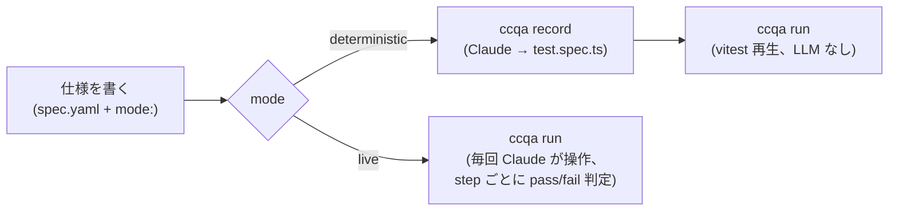

# ccqa

**あなたの Claude サブスクリプションには、すでに QA エンジニアが含まれています。**

ccqa は Claude Code をブラウザテストレコーダーに変えます。YAML で仕様を書き、その仕様に **deterministic** か **live** かを宣言すると、`ccqa run` が spec ごとに適切な実行モードを選びます。

- **Deterministic** (`mode: deterministic`、デフォルト): `ccqa record` で 1 回だけ Claude にブラウザを操作させ、その操作を vitest 互換の `test.spec.ts` にコンパイルします。CI では vitest で再生するだけ — 実行時に LLM は介在しません。最も安価で安定。
- **Live** (`mode: live`): codegen は不要。`ccqa run` が毎回 Claude に step を投げ、Claude が直接 `agent-browser` でブラウザを操作し、step の `expected` を満たすか pass/fail で判定、各 step の前後に PNG を保存します。フラジャイルな UI に強い。

1 つのプロジェクトで両モードを混在できます。spec.yaml ごとに mode を選び、`ccqa run` が field を読み取って dispatch します。HTML レポートも 1 ページに統合されます。

追加の API キーは不要。`claude` だけで動きます。

[English README](../README.md)

## 仕組み



deterministic spec は `ccqa record` で Claude が一歩ずつ操作した結果を `test.spec.ts` に固めます。以後 `ccqa run` は vitest で決定論的に再生するだけです。

live spec は `record` 不要です。`ccqa run` が直接 Claude に step を投げ、Claude が `agent-browser` を介してブラウザを操作し、step の `expected` を満たすか判定、各 step の前後で PNG を残します。タイミング依存・リッチエディタ・動的セレクタなど codegen が脆い場面で有用です。

## インストール

```bash
pnpm add -D ccqa vitest agent-browser
```

Node.js **20+** が必要です。[agent-browser](https://github.com/vercel-labs/agent-browser) は peer dependency です。

## クイックスタート

**1. 仕様を書く** — 手書き、または対話的に [`ccqa draft`](./draft.md) で。実行モードは spec 自体で宣言します。

```yaml
# .ccqa/features/tasks/test-cases/create-and-complete/spec.yaml
title: タスクを作成して完了にする
mode: deterministic   # または live。省略時は deterministic。

steps:
  - instruction: |
      ${APP_URL}/login を開く。メールアドレスとパスワードを入力してフォームを送信する。
    expected: /dashboard にリダイレクトされ、ヘッダーにユーザーアバターが表示される

  - instruction: |
      "New Task" をクリックし、タイトル "Fix login bug" を入力、優先度を High に設定して保存
    expected: タスク一覧に "Open" ステータスで表示される
```

URL は `instruction` 内に直接書きます。環境ごとに切り替えたい値は `${ENV_VAR}` で参照します。

**2a. `mode: deterministic` の場合 — 1 回 record、以後は再生**

```bash
ccqa record tasks/create-and-complete   # Claude がブラウザを操作し、test.spec.ts を生成
ccqa run tasks/create-and-complete      # vitest が test.spec.ts を再生 (LLM なし)
```

**2b. `mode: live` の場合 — codegen 不要、直接実行**

```bash
ccqa run tasks/create-and-complete      # 毎回 Claude がブラウザを操作
```

live spec は spec.yaml の top-level に `session: <name>` を書くと、保存済みのブラウザセッション (cookies + localStorage) を起動時に復元できます。`ccqa session bootstrap <name>` で 1 度ローカルで手動ログインして保存しておけば、デバイス信頼ゲートを以後の run でスキップできます。詳細は下の [保存済みセッション](#保存済みセッション-session) を参照。

deterministic spec はデフォルトで step 境界のスクショとメタデータを `ccqa-report/evidence/<feature>/<spec>/` に書き出します。`expected` が記述する状態に実際に到達したか、レビュアーが確認できます。`--no-evidence` で抑止できます。

CI で HTML 実行レポートを出力したい場合は `--report` を付けます。失敗 spec ごとに drift audit と、ブランチの git 差分をコンテキストとした原因分類 (TEST_DRIFT / SPEC_CHANGE / PRODUCT_BUG) が付き、レポート上で人が正解を入力すると分類精度 (混同行列) をその場で計測できます。分析には `ANTHROPIC_API_KEY` か Claude Code のログインが必要です。`--no-failure-analysis` で分類を止められます (drift audit も連動して止まります — drift は分類の根拠として表示されるため、分類を止めるなら drift も無駄になるからです)。分類は欲しいが audit だけ止めたい場合は `--no-drift-audit` を使ってください。詳細は [Run report](./report.md)。

```bash
ccqa run tasks/create-and-complete --report --base origin/main
ccqa run --changed --report                  # relatedPaths が diff に当たる spec だけ
```

## 機能

各詳細ドキュメントは英語版です。

| 機能 | ドキュメント |
|---|---|
| Claude と対話しながら仕様を書く | [Draft](./draft.md) |
| ログインなど共通手順を使い回す | [Blocks](./blocks.md) |
| OS のファイル選択ダイアログを介さずに `<input type="file">` を扱う | [File upload](./file-upload.md) |
| アサーションヘルパー関数 | [Assertions](./assertions.md) |
| 失敗したテストを自動修正 | [Auto-fix](./auto-fix.md) |
| CI で仕様とコードのズレを検出 | [Drift](./drift.md) |
| 失敗原因分類つき HTML 実行レポート | [Run report](./report.md) |
| 既存のテストカバレッジを棚卸し | [Perspectives](./perspectives.md) |
| 設計判断の記録 (なぜこの設計か) | [ADR](./adr/README.md) |

## コマンド

```
ccqa init                          .ccqa/prompts/{live,record}.{user,agent}.md のテンプレートを作成
ccqa draft [feature/spec]          Claude と一緒にテスト仕様を作成
ccqa perspectives                  既存のテストカバレッジを .ccqa/perspectives.yaml に棚卸し
ccqa record <feature/spec>         (deterministic spec 専用) ブラウザ操作を記録し test.spec.ts を生成
ccqa run [feature/spec...]         spec を実行。spec ごとに spec.yaml の mode: フィールドが
                                   deterministic (vitest 再生) か live (毎回 Claude が操作) かを決める。
                                   1 回の run で両方の spec を混在できる。`--report` で 1 つの統一 HTML を出力。
                                   複数 target をスペース区切りで指定可。
ccqa drift [feature/spec]          単独の仕様 ↔ コードベース監査 (定期ジョブ用)
```

`ccqa run` の主なフラグ:

- `--report [dir]` — 単一の HTML 実行レポートを出力 (デフォルトディレクトリ: `ccqa-report/`)
- `--profile <name>` — spec の `${VAR}` 参照を解決する前に `.ccqa/profiles/<name>.env` を環境に読み込み、1 つの spec を環境ごとにコピーせず dev/stg/prd に向けられるようにする。詳細は [プロファイル](#プロファイル---profile)。
- `--changed` — `relatedPaths` が `git diff <base>...HEAD` に当たる spec だけに絞って実行 (明示的な spec 指定とは併用不可)
- `--concurrency <n>` — **各モード内**で最大 N spec を並列実行 (deterministic は 1 フェーズ、live は次フェーズ。並列化はフェーズ内のみで、フェーズ間はしない)。デフォルト `1` (逐次。従来と完全に同じ挙動)。2 以上では spec ごとに出力をバッファし、完了時にラベル付きブロックでまとめて flush するのでログが混ざらない。live spec は spec 数ぶんの headed Chrome を起動するため、高い値に注意。
- `--base <ref>` — git 差分の base ref (デフォルト: `$GITHUB_BASE_REF` → `origin/main`)
- `--no-failure-analysis` — 失敗の自動分類をスキップ (drift audit も連動でスキップ)
- `--no-drift-audit` — 分類は残したまま drift audit だけスキップ
- `--no-evidence` — (deterministic spec 限定) step 境界の PNG キャプチャをスキップ
- `--retry <n>` — (live spec 限定) 失敗 step を N 回まで再試行
- `--format <fmt>` — `text` (デフォルト) / `json` (`report.json`) / `github` (Actions annotation)
- `--out <dir>` — (live spec 限定、単一 spec 実行時) per-run artifact ディレクトリを上書き
- `--update-agent-prompt` — (live spec 限定) 実行終了後、その run のサマリを Claude に渡して `.ccqa/prompts/live.agent.md` を上書き更新。プロジェクト固有の学びを次回 run に反映できる。`ccqa record` にも同名のフラグがあり、`record.agent.md` を更新する。

すべての Claude 駆動コマンドは `-m, --model <name>` を受け付けます (`sonnet` | `opus` | `haiku` のエイリアス、またはフルモデル ID)。このフラグは `CCQA_MODEL` 環境変数を上書きします。両方とも未設定の場合は Claude Code CLI のデフォルトが使われます。また `--language <bcp47>` (例: `ja`、`en`) で人間向け出力の言語を指定できます。デフォルトの `auto` は spec / コードベースの言語に追従します。`--cwd <path>` は `record` / `run` / `drift` で使え、モノレポのルートからサブパッケージを指定できます。対話型コマンドはローカルの Claude Code ログインで認証します。CI で Claude を使うコマンド (`ccqa run --report`、`ccqa drift`) は `ANTHROPIC_API_KEY` も受け付けます。

`<feature/spec>` は `.ccqa/features/<feature>/test-cases/<spec>/` への 2 セグメントのエイリアスです。`ccqa run` は複数 target をスペース区切りで受け付けます (各 target は `<feature>/<spec>`、配下全件を指す `<feature>`、または省略で全件)。重複は排除され、`--changed` と明示的な target は併用できません。

## 保存済みセッション (`session:`)

live spec はデフォルトでは未ログイン状態から始まり、spec の steps の中でログインします。単純なフォームログインならそれで十分ですが、プロバイダによっては新規ブラウザごとにデバイス信頼ゲート (見慣れないデバイス確認のメールコード、MFA プロンプトなど) が出て、人間が手で突破する必要があります。これを毎回 run で繰り返すのは非現実的で、CI では不可能です。

そうしたケースでは、サインイン済みのブラウザステートを 1 度保存しておき、spec から **復元** します。ccqa は認証そのものを管理しません。`session` は cookies + localStorage を復元するだけの任意機能です。普通にログインできる spec は `session` を使いません。

```yaml
title: admin は設定ページを開ける
mode: live
session: admin            # step 1 の前に保存済み "admin" セッションを復元
steps:
  - ...                   # ログイン手順は書かない。サインイン済みで始まる
```

1 つの spec で複数のセッションを同時に復元することもできます (例: プロバイダごとに 1 つ)。ccqa がそれらをマージします。

```yaml
session:
  - admin                 # あるプロバイダに admin でサインイン
  - admin-chat            # 別のプロバイダ、同一人物
```

### セッションを作る — `ccqa session bootstrap`

```bash
# headed ブラウザが開く。手でログインし (デバイス信頼ゲートも突破)、
# Enter を押すと ccqa がセッションを保存する。
ccqa session bootstrap admin --url https://app.example.com/login

# 保存済みセッション一覧 (名前と保存時刻のみ。秘密値は表示しない)。
ccqa session ls
```

セッションは `.ccqa/sessions/<profile>/<name>.json` に保存されます。`<profile>` は `.ccqa/profiles/<profile>.env` を選ぶ `--profile` と同じもので、1 つのフラグで環境とそのセッションバケットの両方が決まります（無指定なら `default`）。`ccqa init` が自己無視する `.ccqa/sessions/.gitignore` を作るので、保存済みセッションは git の外に保たれます。**ファイルには有効な認証 cookie が入っており、コミット禁止です。**

spec が未作成のセッション名を指すと、run は未認証で始める代わりに停止し、どの `ccqa session bootstrap` を実行すればよいか案内します。

### CI でセッションを復元する

保存済みセッションは完全に `.ccqa/` 配下に閉じており `~/` に触りません。CI では各セッションファイルを run が期待するパスへ書き戻すだけです (secret store から読み込む)。

```bash
# ローカルで bootstrap した後、CI の secret store にコピー:
base64 -i .ccqa/sessions/default/admin.json | pbcopy   # CCQA_SESSION_ADMIN_B64 として貼り付け
```

```yaml
# CI step (抜粋) — `ccqa run` の前に復元
- name: Restore session
  env:
    CCQA_SESSION_ADMIN_B64: ${{ secrets.CCQA_SESSION_ADMIN_B64 }}
  run: |
    mkdir -p .ccqa/sessions/default
    printf '%s' "$CCQA_SESSION_ADMIN_B64" | base64 -d > .ccqa/sessions/default/admin.json
```

注意点:

- **有効期限**: プロバイダの「このデバイスを記憶する」期間を過ぎると保存済み cookie が失効します。ローカルで `ccqa session bootstrap` をやり直し、secret を rotate してください。
- **クレデンシャル扱い**: セッションファイルには有効な認証 cookie が入っています。secret manager に格納し、コミットしないでください。
- **deterministic spec は `session:` を無視します**: `mode: live` だけが対象で、vitest 再生は常に isolated に走ります。

## ファイル構成

```
.ccqa/
  perspectives.yaml              # 既存カバレッジの棚卸し (機械可読・正)
  perspectives.md                # カテゴリ一覧インデックス (YAML から再生成)
  profiles/                      # `--profile <name>` の環境変数ファイル
    stg.env                      # URL + 認証情報の参照。secret manager 参照ならコミット可、平文 secret なら gitignore
    prd.env
  prompts/                       # `ccqa init` でテンプレートを作成可能
    record.user.md               # `ccqa record` (trace 段) に追加される人手メンテのプロジェクト固有ガイダンス
    record.agent.md              # `ccqa record --update-agent-prompt` が更新する自動学習ノート
    live.user.md                 # `ccqa run` (live spec 実行時) に追加される人手メンテのプロジェクト固有ガイダンス
    live.agent.md                # `ccqa run --update-agent-prompt` が更新する自動学習ノート
  blocks/
    login/
      spec.yaml                  # 再利用可能なブロック (params + steps)
  features/
    tasks/
      perspectives.md            # カテゴリ単位の詳細テーブル (ケースごと)
      test-cases/
        create-and-complete/
          spec.yaml              # テスト定義 (mode: deterministic | live を含む)
          actions.json           # (deterministic のみ) `ccqa record` で記録された操作
          test.spec.ts           # (deterministic のみ) 生成された vitest スクリプト
          runs/
            2026-06-14T10-00-00-000Z/  # (live のみ) `ccqa run` 1 回分の成果物
              run.json
              run.md
              steps/
                step-01.before.png
                step-01.after.png
                step-01.log.txt
```

`.ccqa/features/*/test-cases/*/runs/` と `ccqa-report*/` は `.gitignore` に追加してください。前者は per-run の一時成果物、後者は HTML レポート出力先で、いずれもコミット対象ではありません。

## プロファイル (`--profile`)

環境依存値を `${VAR}` 参照として spec の外に出し、環境ごとに**プロファイル** (`.ccqa/profiles/<name>.env`) から供給します。`ccqa run`/`record --profile <name>` は `${VAR}` を解決する前に環境へマージするので、1 つの spec をどの環境にも向けられます。

```bash
# .ccqa/profiles/stg.env
APP_BASE_URL=https://<your-app-host>
TEST_USER_EMAIL=<stg-test-account>
TEST_USER_PASSWORD=...
```
```bash
ccqa run auth/login --profile stg    # 同じ spec、stg の値
```

- 名前は自由 (`stg`/`prd` は慣例)。パス区切り・`..`・先頭ドットは拒否、存在しない名前は exit 2。ログに出るのは名前だけで値は出ません。
- 形式は小さな `.env` サブセット (`KEY=value`、`#` コメント、`export`、クォート)。プロファイルの値は既存環境を**上書き**します。
- `--profile` 無しなら `<cwd>/.env` を自動ロード (dotenv と同じ)。どちらも無ければ `${VAR}` は既存の `process.env` (例: `direnv`) から解決。

**secret:** 平文 secret を含むプロファイルは gitignore してください。ccqa は `.env` をパースするだけで secret manager の参照は解決しないので、secret をディスクに置きたくなければ `--profile` を外し、secret manager 経由で ccqa を実行します (例: `op run --env-file=.ccqa/profiles/stg.env -- ccqa run ...`)。解決済みの値が `process.env` に入り、ccqa はそれを読みます。

## ライセンス

MIT
