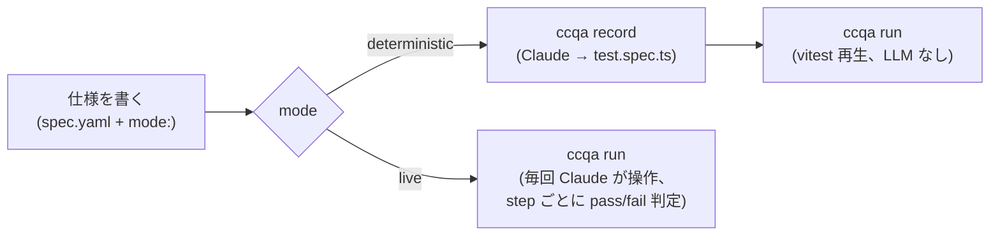

# ccqa

**あなたの Claude サブスクリプションには、すでに QA エンジニアが含まれています。**

ccqa は Claude Code をブラウザテストレコーダーに変えます。YAML で仕様を書き、その仕様に **deterministic** か **live** かを宣言すると、`ccqa run` が spec ごとに適切な実行モードを選びます。

- **Deterministic** (`mode: deterministic`、デフォルト): `ccqa record` で 1 回だけ Claude にブラウザを操作させ、その操作を vitest 互換の `test.spec.ts` にコンパイルします。CI では vitest で再生するだけ — 実行時に LLM は介在しません。最も安価で安定。
- **Live** (`mode: live`): codegen は不要。`ccqa run` が毎回 Claude に step を投げ、Claude が直接 `agent-browser` でブラウザを操作し、step の `expected` を満たすか pass/fail で判定、各 step の前後に PNG を保存します。フラジャイルな UI に強い。

1 つのプロジェクトで両モードを混在できます。spec.yaml ごとに mode を選び、`ccqa run` が field を読み取って dispatch します。HTML レポートも 1 ページに統合されます。

追加の API キーは不要。`claude` だけで動きます。

[English README](../README.md)

## 仕組み



deterministic spec は `ccqa record` で Claude が一歩ずつ操作した結果を `test.spec.ts` に固めます。以後 `ccqa run` は vitest で決定論的に再生するだけです。

live spec は `record` 不要です。`ccqa run` が直接 Claude に step を投げ、Claude が `agent-browser` を介してブラウザを操作し、step の `expected` を満たすか判定、各 step の前後で PNG を残します。タイミング依存・リッチエディタ・動的セレクタなど codegen が脆い場面で有用です。

## インストール

```bash
pnpm add -D ccqa vitest agent-browser
```

Node.js **20+** が必要です。[agent-browser](https://github.com/vercel-labs/agent-browser) は peer dependency です。

## クイックスタート

**1. 仕様を書く** — 手書き、または対話的に [`ccqa draft`](./draft.md) で。実行モードは spec 自体で宣言します。

```yaml
# .ccqa/features/tasks/test-cases/create-and-complete/spec.yaml
title: タスクを作成して完了にする
mode: deterministic   # または live。省略時は deterministic。

steps:
  - instruction: |
      ${APP_URL}/login を開く。メールアドレスとパスワードを入力してフォームを送信する。
    expected: /dashboard にリダイレクトされ、ヘッダーにユーザーアバターが表示される

  - instruction: |
      "New Task" をクリックし、タイトル "Fix login bug" を入力、優先度を High に設定して保存
    expected: タスク一覧に "Open" ステータスで表示される
```

URL は `instruction` 内に直接書きます。環境ごとに切り替えたい値は `${ENV_VAR}` で参照します。

**2a. `mode: deterministic` の場合 — 1 回 record、以後は再生**

```bash
ccqa record tasks/create-and-complete   # Claude がブラウザを操作し、test.spec.ts を生成
ccqa run tasks/create-and-complete      # vitest が test.spec.ts を再生 (LLM なし)
```

**2b. `mode: live` の場合 — codegen 不要、直接実行**

```bash
ccqa run tasks/create-and-complete      # 毎回 Claude がブラウザを操作
```

live spec は spec.yaml の top-level に `statePath: <path>` を書くと、`agent-browser state save` で保存した認証済みブラウザステート (cookies + localStorage) を起動時に読み込めます。Slack の "We don't recognize this browser" などのデバイス信頼ゲートを 1 度ローカルで突破して保存しておけば、以後のローカル run・CI run でずっとスキップできます。詳細は下の [Pre-authenticated state](#pre-authenticated-state-statepath) を参照。

deterministic spec はデフォルトで step 境界のスクショとメタデータを `ccqa-report/evidence/<feature>/<spec>/` に書き出します。`expected` が記述する状態に実際に到達したか、レビュアーが確認できます。`--no-evidence` で抑止できます。

CI で HTML 実行レポートを出力したい場合は `--report` を付けます。失敗 spec ごとに drift audit と、ブランチの git 差分をコンテキストとした原因分類 (TEST_DRIFT / SPEC_CHANGE / PRODUCT_BUG) が付き、レポート上で人が正解を入力すると分類精度 (混同行列) をその場で計測できます。分析には `ANTHROPIC_API_KEY` か Claude Code のログインが必要です。`--no-failure-analysis` で分類を止められます (drift audit も連動して止まります — drift は分類の根拠として表示されるため、分類を止めるなら drift も無駄になるからです)。分類は欲しいが audit だけ止めたい場合は `--no-drift-audit` を使ってください。詳細は [Run report](./report.md)。

```bash
ccqa run tasks/create-and-complete --report --base origin/main
ccqa run --changed --report                  # relatedPaths が diff に当たる spec だけ
```

## 機能

各詳細ドキュメントは英語版です。

| 機能 | ドキュメント |
|---|---|
| Claude と対話しながら仕様を書く | [Draft](./draft.md) |
| ログインなど共通手順を使い回す | [Blocks](./blocks.md) |
| OS のファイル選択ダイアログを介さずに `<input type="file">` を扱う | [File upload](./file-upload.md) |
| アサーションヘルパー関数 | [Assertions](./assertions.md) |
| 失敗したテストを自動修正 | [Auto-fix](./auto-fix.md) |
| CI で仕様とコードのズレを検出 | [Drift](./drift.md) |
| 失敗原因分類つき HTML 実行レポート | [Run report](./report.md) |
| 既存のテストカバレッジを棚卸し | [Perspectives](./perspectives.md) |
| 設計判断の記録 (なぜこの設計か) | [ADR](./adr/README.md) |

## コマンド

```
ccqa init                          .ccqa/prompts/{live,record}.{user,agent}.md のテンプレートを作成
ccqa draft [feature/spec]          Claude と一緒にテスト仕様を作成
ccqa perspectives                  既存のテストカバレッジを .ccqa/perspectives.yaml に棚卸し
ccqa record <feature/spec>         (deterministic spec 専用) ブラウザ操作を記録し test.spec.ts を生成
ccqa run [feature/spec]            spec を実行。spec ごとに spec.yaml の mode: フィールドが
                                   deterministic (vitest 再生) か live (毎回 Claude が操作) かを決める。
                                   1 回の run で両方の spec を混在できる。`--report` で 1 つの統一 HTML を出力。
ccqa drift [feature/spec]          単独の仕様 ↔ コードベース監査 (定期ジョブ用)
```

`ccqa run` の主なフラグ:

- `--report [dir]` — 単一の HTML 実行レポートを出力 (デフォルトディレクトリ: `ccqa-report/`)
- `--changed` — `relatedPaths` が `git diff <base>...HEAD` に当たる spec だけに絞って実行 (明示的な spec 指定とは併用不可)
- `--base <ref>` — git 差分の base ref (デフォルト: `$GITHUB_BASE_REF` → `origin/main`)
- `--no-failure-analysis` — 失敗の自動分類をスキップ (drift audit も連動でスキップ)
- `--no-drift-audit` — 分類は残したまま drift audit だけスキップ
- `--no-evidence` — (deterministic spec 限定) step 境界の PNG キャプチャをスキップ
- `--retry <n>` — (live spec 限定) 失敗 step を N 回まで再試行
- `--format <fmt>` — `text` (デフォルト) / `json` (`report.json`) / `github` (Actions annotation)
- `--out <dir>` — (live spec 限定、単一 spec 実行時) per-run artifact ディレクトリを上書き
- `--update-agent-prompt` — (live spec 限定) 実行終了後、その run のサマリを Claude に渡して `.ccqa/prompts/live.agent.md` を上書き更新。プロジェクト固有の学びを次回 run に反映できる。`ccqa record` にも同名のフラグがあり、`record.agent.md` を更新する。

すべての Claude 駆動コマンドは `-m, --model <name>` を受け付けます (`sonnet` | `opus` | `haiku` のエイリアス、またはフルモデル ID)。このフラグは `CCQA_MODEL` 環境変数を上書きします。両方とも未設定の場合は Claude Code CLI のデフォルトが使われます。また `--language <bcp47>` (例: `ja`、`en`) で人間向け出力の言語を指定できます。デフォルトの `auto` は spec / コードベースの言語に追従します。`--cwd <path>` は `record` / `run` / `drift` で使え、モノレポのルートからサブパッケージを指定できます。対話型コマンドはローカルの Claude Code ログインで認証します。CI で Claude を使うコマンド (`ccqa run --report`、`ccqa drift`) は `ANTHROPIC_API_KEY` も受け付けます。

`<feature/spec>` は `.ccqa/features/<feature>/test-cases/<spec>/` への 2 セグメントのエイリアスです。

## Pre-authenticated state (`statePath:`)

live spec はデフォルトでは run のたびに `agent-browser` を新規セッションで起動し、未ログイン状態から始まります。run が hermetic になる代わりに、Slack の "We don't recognize this browser" や Google の見慣れないデバイス確認、MFA プロンプトなどのデバイス信頼ゲートが毎回発火します。

これを回避するには、認証済みブラウザステートをローカルで 1 度 JSON ファイルに保存し、spec.yaml の top-level でそのパスを参照します。

```yaml
title: Slack App Home — 非管理者ユーザーはアクセスを拒否される
mode: live
statePath: .ccqa/sessions/slack-stg.json   # 復元する cookies + localStorage
steps:
  - ...
```

ccqa はこの path をプロジェクトルートから resolve し、その run 中の全 `agent-browser` 呼び出し (ccqa 自身の screenshot も含む) に `--state <path>` を渡します。このファイルは **read-only** — `--state` は読み込むだけで書き戻しません。ローカルでも CI でも、 何度 run してもファイルは変化しません。

初回だけローカルで bootstrap:

```bash
# 1. headed ブラウザで手動ログイン。
agent-browser --headed open https://app.slack.com
# …ログインとデバイス信頼プロンプトを手で通す…

# 2. spec が参照するパスに cookies + localStorage を保存。
mkdir -p .ccqa/sessions
agent-browser state save .ccqa/sessions/slack-stg.json
agent-browser close

# 3. ccqa run は保存済みステートを再利用 — ログイン不要。
ccqa run slack/app-home-non-admin-access-denied
```

`.ccqa/sessions/` は `.gitignore` に必ず追加してください。 ファイルには有効な認証 cookie が入っており、コミット禁止です。

### CI でステートを持ち込む

`statePath:` は完全に `.ccqa/` 配下に閉じているので、 CI でも `~/` に触らず spec が参照する同じパスにファイルを置くだけで再利用できます。

```bash
# ローカルで bootstrap した後:
base64 -i .ccqa/sessions/slack-stg.json | pbcopy
# CI の secret store に CCQA_SLACK_STG_STATE_B64 として貼り付け
```

```yaml
# .github/workflows/ccqa.yml (抜粋)
- name: Restore agent-browser state
  env:
    CCQA_SLACK_STG_STATE_B64: ${{ secrets.CCQA_SLACK_STG_STATE_B64 }}
  run: |
    mkdir -p .ccqa/sessions
    printf '%s' "$CCQA_SLACK_STG_STATE_B64" | base64 -d \
      > .ccqa/sessions/slack-stg.json

- name: Run live specs
  env:
    ANTHROPIC_API_KEY: ${{ secrets.ANTHROPIC_API_KEY }}
  run: pnpm ccqa run --report
```

注意点:

- **有効期限**: 上流サービスの「このデバイスを記憶する」期間 (Slack ≈ 30 日、他サービスは様々) を過ぎると state ファイル内の cookie が失効し、CI でまたデバイス信頼ゲートに引っかかります。ローカルで再 bootstrap して secret を rotate してください。
- **クレデンシャル扱い**: ファイルには有効な認証 cookie が入っています。GitHub Actions の encrypted secrets / Vault などの secret manager に必ず格納し、リポジトリにコミットしないでください。
- **deterministic spec は `statePath:` を無視します**: 現状 `mode: live` だけが対象で、vitest 再生は常に isolated に走ります。

## ファイル構成

```
.ccqa/
  perspectives.yaml              # 既存カバレッジの棚卸し (機械可読・正)
  perspectives.md                # カテゴリ一覧インデックス (YAML から再生成)
  prompts/                       # `ccqa init` でテンプレートを作成可能
    record.user.md               # `ccqa record` (trace 段) に追加される人手メンテのプロジェクト固有ガイダンス
    record.agent.md              # `ccqa record --update-agent-prompt` が更新する自動学習ノート
    live.user.md                 # `ccqa run` (live spec 実行時) に追加される人手メンテのプロジェクト固有ガイダンス
    live.agent.md                # `ccqa run --update-agent-prompt` が更新する自動学習ノート
  blocks/
    login/
      spec.yaml                  # 再利用可能なブロック (params + steps)
  features/
    tasks/
      perspectives.md            # カテゴリ単位の詳細テーブル (ケースごと)
      test-cases/
        create-and-complete/
          spec.yaml              # テスト定義 (mode: deterministic | live を含む)
          actions.json           # (deterministic のみ) `ccqa record` で記録された操作
          test.spec.ts           # (deterministic のみ) 生成された vitest スクリプト
          runs/
            2026-06-14T10-00-00-000Z/  # (live のみ) `ccqa run` 1 回分の成果物
              run.json
              run.md
              steps/
                step-01.before.png
                step-01.after.png
                step-01.log.txt
```

`.ccqa/features/*/test-cases/*/runs/` と `ccqa-report*/` は `.gitignore` に追加してください。前者は per-run の一時成果物、後者は HTML レポート出力先で、いずれもコミット対象ではありません。

## ライセンス

MIT
