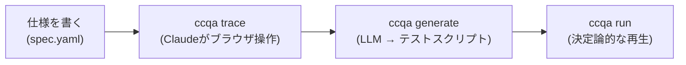

# ccqa

**あなたの Claude サブスクリプションには、すでに QA エンジニアが含まれています。**

ccqa は Claude Code をブラウザテストレコーダーに変えます。YAML で仕様を書き、`ccqa trace` を実行すると、Claude が [agent-browser](https://github.com/vercel-labs/agent-browser) を介してアプリを操作します。すべての操作が記録され、CI で実行できる決定論的なテストスクリプトにコンパイルされます。追加の API キーは不要。`claude` だけで動きます。

[English README](../README.md)

## 仕組み



`trace` は仕様を渡して Claude Code を起動します。Claude は一歩ずつブラウザを操作し、すべての操作を構造化データとして記録します。`generate` はそのデータを vitest 互換のスクリプトにコンパイルします。`run` はそれを決定論的に再生します — LLM は介在しません。

## インストール

```bash
pnpm add -D ccqa vitest agent-browser
```

Node.js **20+** が必要です。[agent-browser](https://github.com/vercel-labs/agent-browser) は peer dependency です。

## クイックスタート

**1. 仕様を書く** — 手書き、または対話的に [`ccqa draft`](./draft.md) で

```yaml
# .ccqa/features/tasks/test-cases/create-and-complete/spec.yaml
title: タスクを作成して完了にする

steps:
  - instruction: |
      ${APP_URL}/login を開く。メールアドレスとパスワードを入力してフォームを送信する。
    expected: /dashboard にリダイレクトされ、ヘッダーにユーザーアバターが表示される

  - instruction: |
      "New Task" をクリックし、タイトル "Fix login bug" を入力、優先度を High に設定して保存
    expected: タスク一覧に "Open" ステータスで表示される
```

URL は `instruction` 内に直接書きます。環境ごとに切り替えたい値は `${ENV_VAR}` で参照します。

**2. Trace** — Claude がブラウザを操作し、すべての操作を記録

```bash
ccqa trace tasks/create-and-complete
```

**3. Generate** — 記録された操作を再生可能なテストに変換

```bash
ccqa generate tasks/create-and-complete
```

**4. Run** — LLM なしで決定論的に再生

```bash
ccqa run tasks/create-and-complete
```

CI でテスト失敗時にドリフト分析 (spec と現コードベースの比較) を併走させたい場合は `--drift` を付けます。`ANTHROPIC_API_KEY` か Claude Code のログインが必要です。

```bash
ccqa run tasks/create-and-complete --drift --format github
```

## 機能

各詳細ドキュメントは英語版です。

| 機能 | ドキュメント |
|---|---|
| Claude と対話しながら仕様を書く | [Draft](./draft.md) |
| ログインなど共通手順を使い回す | [Blocks](./blocks.md) |
| アサーションヘルパー関数 | [Assertions](./assertions.md) |
| 失敗したテストを自動修正 | [Auto-fix](./auto-fix.md) |
| CI で仕様とコードのズレを検出 | [Drift](./drift.md) |
| 設計判断の記録 (なぜこの設計か) | [ADR](./adr/README.md) |

## コマンド

```
ccqa draft [feature/spec]          Claude と一緒にテスト仕様を作成
ccqa trace <feature/spec>          spec のブラウザ操作を記録 (include した block はインライン展開して一緒に記録)
ccqa generate <feature/spec>       記録された操作から spec のテストスクリプトを生成
ccqa run [feature/spec]            生成されたテストスクリプトを実行 (--drift で失敗時にドリフト分析)
ccqa drift [feature/spec]          単独の仕様 ↔ コードベース監査 (定期ジョブ用)
```

すべての Claude 駆動コマンドは `-m, --model <name>` を受け付けます (`sonnet` | `opus` | `haiku` のエイリアス、またはフルモデル ID)。このフラグは `CCQA_MODEL` 環境変数を上書きします。両方とも未設定の場合は Claude Code CLI のデフォルトが使われます。対話型コマンドはローカルの Claude Code ログインで認証します。CI で Claude を使うコマンド (`ccqa run --drift`、`ccqa drift`) は `ANTHROPIC_API_KEY` も受け付けます。

`<feature/spec>` は `.ccqa/features/<feature>/test-cases/<spec>/` への 2 セグメントのエイリアスです。

## ファイル構成

```
.ccqa/
  blocks/
    login/
      spec.yaml                  # 再利用可能なブロック (params + steps)
  features/
    tasks/
      test-cases/
        create-and-complete/
          spec.yaml              # テスト定義
          actions.json           # trace で記録された操作
          test.spec.ts           # 生成されたテストスクリプト
```

## ライセンス

MIT
